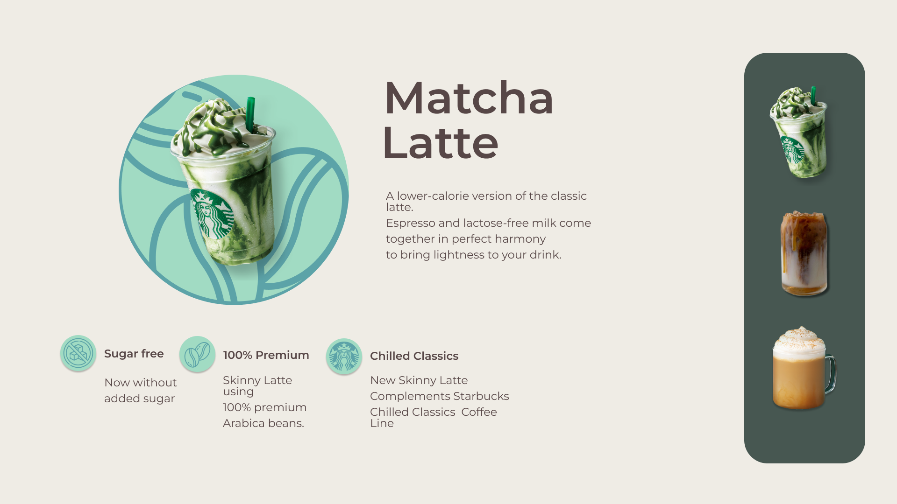

# Coffee-Site
This is a simple project named "Coffee-Site" created using HTML, CSS, and JavaScript. The project is a website that displays information about coffee, including images taken from the assets folder within the repository.

# Teckhnologies Used
HTML: Used for the basic structure of the website.
CSS: Used for designing the layout and appearance of the pages.
JavaScript: Used to add interactivity and dynamic features to the website.

# Installation
Clone repository

git clone https://github.com/BagusArif9/coffe-page

Enjoy your coffee and explore this site for more information about the world of coffee! ☕️
